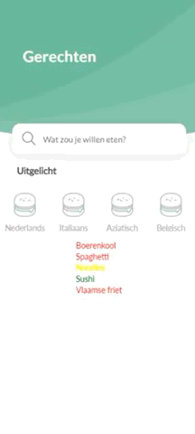

# Recepten
Recepten is een onderdeel van onze progressive web-app genaamd Mattie. 

# images


# Plugins
```js
 $.fn.changeColorOnTextLength = function () {
    for (let i = 0; i < this.length; i++) {
      if (this[i].innerText.length > 7) {
        this[i].style.color = 'red'
      }
      if (this[i].innerText.length < 7) {
        this[i].style.color = 'green'
      }
      if (this[i].innerText.length === 7) {
        this[i].style.color = 'yellow'
      }
    }
    return this;
  };
``` 
In bovenstaande functie kan aan de hand van de lengtevan eennwwroord een kleur gegeven

```js
 $.fn.generateDishes = function (listElement, clean, items) { 
    var d = document.getElementById(listElement);
    // clean list before add depending on variable 'clean'
    if (clean) {
      d.innerHTML = ""
    }
    // loops through given variable 'items' and adds dish to div
    for (let index = 0; index < items.length; index++) {
      var obj = document.createElement('div');
      obj.className = "dish";
      obj.innerHTML = items[index].dishName;
      d.appendChild(obj)
    }
  }
``` 
Registeert voor nu alleen de ServiceWorker, maar hier mogen andere functies aan toegevoegd worden.

# manifest.json
Dit bestand zorgt ervoor dat de browser herkent dat het een webapp is en hoe de webapp gebruikt moet worden als hij "geïnstalleerd" is.

# README.md
Een bestand met de uitleg van alle componenten.
dennis test.
# stylesheet.css
De styling van de app 'Mattie'.

# sw.js
De ServiceWorker is nodig om aan te geven welke bestanden in de cache opgeslagen moeten worden. Bestanden die in deze cache staan kunnen ook offline geladen worden, omdat ze lokaal zijn opgeslagen.
